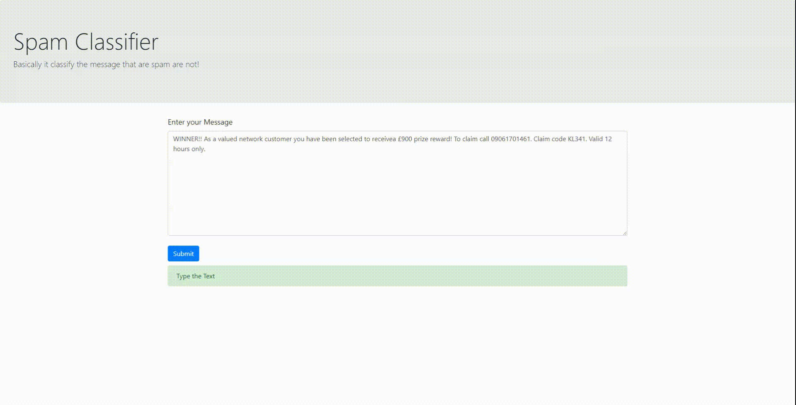

# Spam Classification

#### Import all the necessary library 
```python
import numpy as np
import pandas as pd
import matplotlib.pyplot as plt
```

#### Read the TSV file 
```python
df=pd.read_csv('spam.tsv',sep='\t')
df.head()
```


    label	Text
    0	ham	I've been searching for the right words to tha...
    1	spam	Free entry in 2 a wkly comp to win FA Cup fina...
    2	ham	Nah I don't think he goes to usf, he lives aro...  
    3	ham	Even my brother is not like to speak with me. ...
    4	ham	I HAVE A DATE ON SUNDAY WITH WILL!!!

#### To Check no. of Values in the label
```python
df['labels'].value_counts()
```

    ham     4821
    spam     746
    Name: label, dtype: int64

Since it is Unbalanced So we need to make it balance ( the accuracy will be poor)

#### Balancing the Label [ ham, spam]

```python
ham=df[df['label']=='ham']
spam=df[df['label']=='spam']
ham=ham.sample(spam.shape[0])
data=ham.append(spam,ignore_index=True)
```
Now, We will split the data into Train and Test Data we need few library 

* RandomForestClassifier (sklearn) - for classifying the Data
* train_test_split (sklearn) - spliting the dataset into train and test
* Pipepline (sklearn) - for classifying using linear two approch
* confusion_matrix,accuracy_score,classification_report - for report
* TfidfVectorizer - TF-IDF 

```python
from sklearn.model_selection import train_test_split
from sklearn.ensemble import RandomForestClassifier
from sklearn.metrics import confusion_matrix,accuracy_score,classification_report
from sklearn.pipeline import Pipeline
from sklearn.feature_extraction.text import TfidfVectorizer
```

#### Create model and Fit

```python
model = Pipeline([('tfidf', TfidfVectorizer()), ('clf', RandomForestClassifier(n_estimators=1000, n_jobs=-1))])
model.fit(X_train, y_train)
```
Pipeline is used for adding more Algorithm linearly, RandomForestClassifier has hyper parameter of n_estimators( no. of tree nodes) n_jobs for CPU ( -1 for CPU , 1 for Debugging)

####  to Check the Loss, Accuracy 
```python
y_pred = model.predict(X_test)
confusion_matrix(y_test, y_pred)
print(classification_report(y_test, y_pred))
accuracy_score(y_test, y_pred)
```
The model accuracy is 0.9263392857142857 

#### Predictions
```python
model.predict(["Hi, How are you"])
# array(['ham'], dtype=object)
model.predict(["congratulations"])
# array(['ham'], dtype=object)
model.predict(["Congrats ,you won 10 crore price . Provide Bank detials for Win Cool prize"])
# array(['spam'], dtype=object)
```
#### Save model in Directory
Using joblib we can save the model
```python
import joblib
filename='model.sav'
joblib.dump(model,filename)
```
It will store in the Directory,Now we create Django Application for Model for userFriendly 
